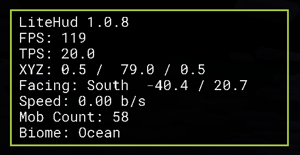
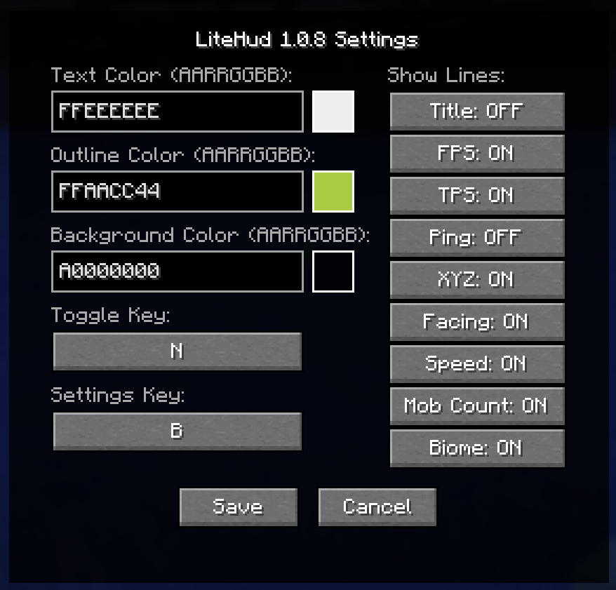

# LiteHud

LiteHud is a minimal, always-on-screen overlay for Fabric that gives you the stats you actually care about — without the bloat.




## Features
- FPS - real-time frame rate
- TPS - server tick rate, averaged over the last 10 ticks
- Ping - your latency to the current server (multiplayer only)
- XYZ Coordinates - your exact position, updated every tick
- Facing - cardinal direction, yaw, and pitch
- Speed - movement speed in blocks per second
- Mob Count - number of mobs currently loaded near you
- Biome - The current Biome the player is in

## Usage
- `B` — open settings screen
- `N` — toggle HUD on/off

## Development

### Build Locally

```
./gradlew build
```

### Run game (offline mode only)
```
./gradlew runClient
```

## Releases

* PRs and commits on main will run a build job and upload an artifact for `litehud-<sha>.jar`
* Create tags locally and push to generate a publish job and release
    ```
    git tag v1.0.0
    git push origin v1.0.0
    ```
